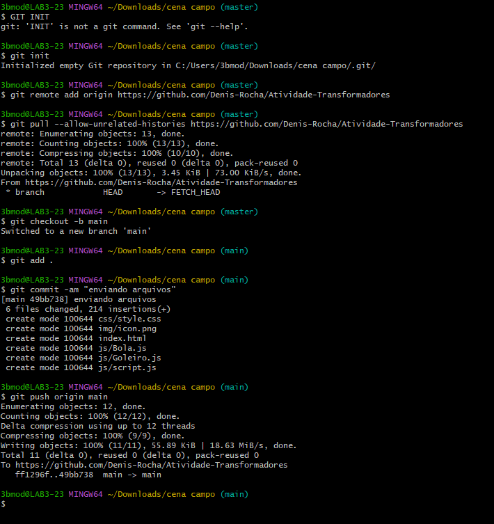
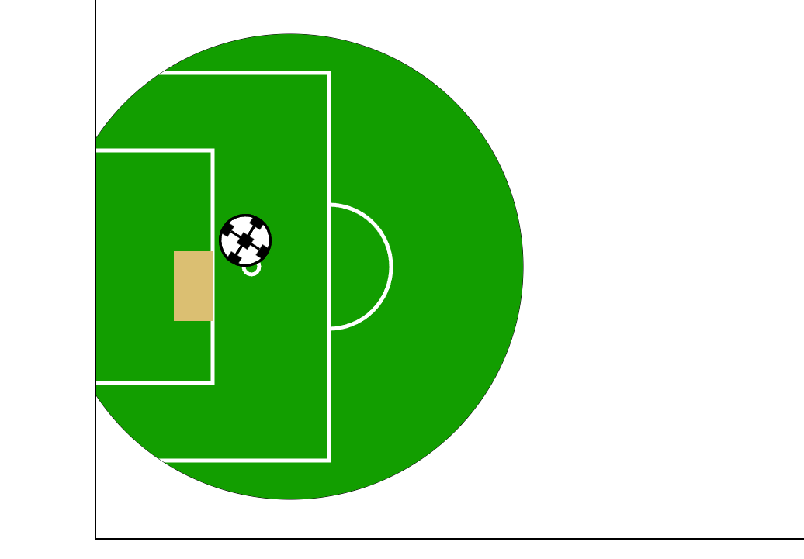
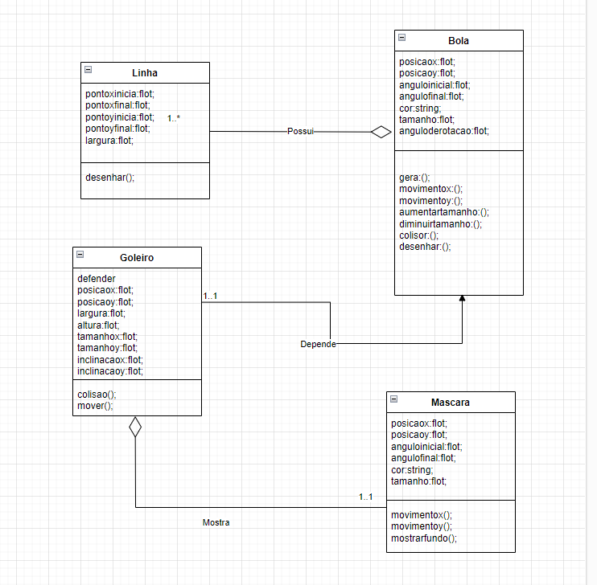

Denis Rocha Lemos e Isabella Correia de Souza

Translação:
Está na bola que se move sozinha

Rotação:
Esta na bola rodando sozinha

Escala:
Está na bola que auemnta e diminui sozinha

Transformação:
Está no retangulo (Goleiro) que vai para cima e para baixo com as setas

Clipping Path:
é o circulo que fica em volta do goleiro

Colisão:
Acontece quando a bola bate nas bordas e no retangulo (goleiro)

